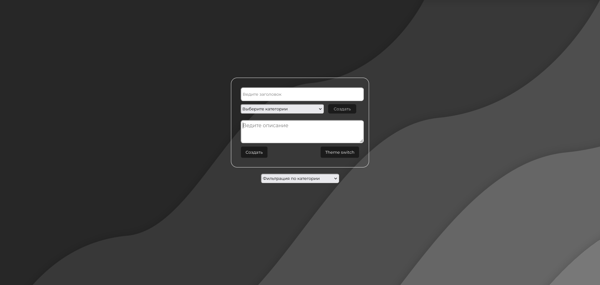

# To-Do List

## Описание

"**To-Do List**" - это веб-приложение для управления списком задач (список дел). С его помощью пользователь может создавать, редактировать и удалять задачи, а также отмечать их как выполненные или невыполненные.

### Основные функции

- Добавление новых задач в список.
- Редактирование названия и описания задачи.
- Отметка задачи как выполненной или невыполненной.
- Удаление задачи из списка.
- Поиск и фильтрация задач по статусу выполнения.

## Технологии

- HTML/CSS - для создания пользовательского интерфейса.
- JavaScript - для создания интерактивных элементов и управления задачами.

## Запуск проекта

Этот проект предназначен для работы в веб-браузере и не требует установки на локальном компьютере. Вы можете просто открыть файл `index.html` в вашем браузере, чтобы начать использовать "To-Do List".

